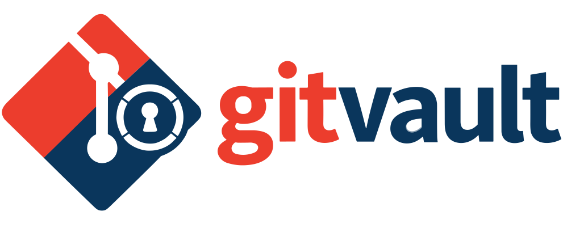

# gitvault



Git-native secrets manager for multi-developer and AI-agent workflows. Secrets are encrypted with
[age](https://age-encryption.org) and stored in your repository — never plaintext, no external
services required.

<p align="center">


</p>


## Features

| Category | Highlights |
|---|---|
| **Encryption** | age standard format; whole-file or per-field (JSON/YAML/TOML); streaming crypto; zeroized plaintext |
| **Multi-recipient** | encrypt once for every team member; per-person `.pub` files; max 256 recipients |
| **Deterministic diffs** | unchanged field values keep existing ciphertext → minimal git noise |
| **Environments** | `GITVAULT_ENV` → `.git/gitvault/env` → `dev`; per-worktree resolution |
| **Onboarding** | `gitvault init` guides identity → recipient → hardening in one command |
| **Recipient ceremony** | PR-based zero-shared-secret onboarding; `identity pubkey`, `recipient add-self` |
| **Rekeying** | `rekey` re-encrypts all secrets to current recipient set; `--dry-run` supported |
| **In-place editing** | `seal`/`unseal` for field-level in-place encryption; `edit` opens sealed or store files in your editor and re-seals on save; `get`/`set` read or update individual key values programmatically |
| **Runtime injection** | `run` injects secrets into child process env; no `.env` file written |
| **Production barrier** | HMAC-SHA256 authenticated timed allow-token; `revoke-prod` clears it immediately |
| **Identity sources** | `--identity-stdin` → `--identity` → `GITVAULT_IDENTITY_FD` → `GITVAULT_IDENTITY` → OS keyring → SSH agent |
| **OS keyring** | macOS Keychain, Linux Secret Service, Windows Credential Manager |
| **Git safety** | pre-commit/pre-push hooks; drift detection; committed-history leak scan; merge driver |
| **CI friendly** | `--json`, `--no-prompt`; `CI=1` auto-enables non-interactive mode; stable exit codes |
| **AWS SSM** | `gitvault ssm pull/push/diff/set`; `--features ssm` |

## Installation

```bash
# macOS
brew install aheissenberger/tools/gitvault

# Build from source
cargo build --release
```

### Prebuilt binaries

Download the latest release from [GitHub Releases](https://github.com/aheissenberger/gitvault/releases):
- `gitvault-linux-x86_64.tar.gz`
- `gitvault-macos-aarch64.tar.gz`
- `gitvault-windows-x86_64.zip`

Each release includes SHA256SUMS and cosign `.sig`/`.pem` files for verification.

## Quick Start

### 1. Set up a new repo

```bash
gitvault init              # one command: identity → add-self → harden → config.toml
```

Then import any existing plaintext secret files with `harden`:

```bash
gitvault harden .env --env dev          # encrypts .env, git rm --cached, gitignores it
gitvault harden config/secrets.json --env dev  # same for any other file
```

> `harden` with a file argument encrypts it, removes it from git tracking, and adds it to
> `.gitignore` — the one-step import command. Use `gitvault encrypt` for files already gitignored.

Finally, commit your encrypted files and public key, then add your team:

```bash
git add .gitvault/
git commit -m "secrets: initial encrypted vault"
git push
```

→ See [docs/recipient-management.md](docs/recipient-management.md) for the full workflow to add team members.

### 2. Join an existing repo (new team member)

```bash
gitvault init              # creates identity, adds your public key to .gitvault/recipients/

# Open a PR with your public key:
git add .gitvault/recipients/ && git commit -m "onboard: add <your-name>"
git push && gh pr create
```

After a maintainer merges and rekeyes: `git pull && gitvault materialize`

→ See [docs/recipient-management.md](docs/recipient-management.md) for the maintainer rekey steps.

### 3. CI/CD

```bash
# Recommended: use GITVAULT_IDENTITY_FD to avoid the key appearing in /proc/<PID>/environ
# (Linux/macOS only; FD is not the secret — only the FD contents are sensitive)
GITVAULT_IDENTITY_FD=3 gitvault materialize --no-prompt --env prod 3<<<"$SECRET_KEY"

# Fallback: GITVAULT_IDENTITY (key path or raw AGE-SECRET-KEY- string)
GITVAULT_IDENTITY="$SECRET_KEY" gitvault materialize --no-prompt --env prod
# Or inject directly without writing .env:
GITVAULT_IDENTITY="$SECRET_KEY" gitvault run --no-prompt -- node server.js
```

> Set `CI=1` (most CI systems do this automatically) to suppress interactive prompts globally.
> Use `GITVAULT_NO_INLINE_KEY_WARN=1` to silence the inline key warning when using `GITVAULT_IDENTITY` with a raw key.

---

## CLI reference

```
gitvault [OPTIONS] <COMMAND>

Global options:  --json  --no-prompt  --identity-stdin  --identity-selector
                 (--aws-profile  --aws-role-arn  only with --features ssm)

Commands:
  init          Onboard a new team member (identity, recipient, repo hardening)
  harden        Harden repo (hooks, .gitignore); or import+encrypt a file with harden <file>
  encrypt       Encrypt a file into .gitvault/store/<env>/ using mirrored source path
  decrypt       Decrypt from .gitvault/store/<env>/ using source path or explicit .age path (--reveal)
  materialize   Materialize secrets to root .env
  status        Check repository safety status
  run           Inject secrets into child process env (--clear-env, --keep-vars)
  allow-prod    Write a timed production allow token
  revoke-prod   Revoke the production allow token immediately
  recipient     Manage recipients: add | remove | list | add-self
  rekey         Re-encrypt all secrets for current recipients (--dry-run, --env, --json)
  keyring       Manage identity key in OS keyring: set | get | delete | set-passphrase | get-passphrase | delete-passphrase
  identity      Manage identities: create [--add-recipient] | pubkey
  check         Preflight validation without side effects (-H / --skip-history-check)
  ai            Print embedded skill or context file for AI agents: ai skill | ai context
  seal          In-place field/value encryption for JSON/YAML/TOML/.env
  unseal        In-place field/value decryption for JSON/YAML/TOML/.env (--reveal)
  edit          Open sealed or encrypted file in editor; re-seal/re-encrypt on save
  get           Read a single key's plaintext value from a sealed or encrypted file
  set           Update (or create) a single key's value in a sealed or encrypted file
  ssm           AWS SSM Parameter Store sync (--features ssm)
```

### Operator quick map

| Task | Command |
|------|---------|
| Onboard new team member | `gitvault init` |
| Import + encrypt existing file | `gitvault harden <file> --env <env>` |
| Encrypt whole file | `gitvault encrypt <file> --env <env>` |
| Seal selected fields in-place | `gitvault seal <file> --fields a.b,c` |
| Seal `.env` values in-place | `gitvault seal .env` |
| Edit a sealed file | `gitvault edit <file>` |
| Edit a store-encrypted file | `gitvault edit <file.age>` |
| Read a single key value | `gitvault get <file> <key>` |
| Update a single key value | `gitvault set <file> <key> <value>` |
| Update a key (secret, no history) | `echo val \| gitvault set <file> <key> --stdin` |
| Decrypt to stdout | `gitvault decrypt <file.age> --reveal` |
| Unseal to stdout | `gitvault unseal <config.json> --reveal` |
| Materialize root `.env` | `gitvault materialize` |
| Run command with injected secrets | `gitvault run --keep-vars <VARS> -- <cmd> [args...]` |
| Safety check (CI-friendly) | `gitvault status --fail-if-dirty --no-prompt` |
| Validate setup (no side effects) | `gitvault check [-H] [--env <env>]` |
| Enable prod operation window | `gitvault allow-prod [--ttl <secs>]` |
| Revoke prod window | `gitvault revoke-prod` |
| Manage recipients | `gitvault recipient add\|remove\|list\|add-self` |
| Re-encrypt after membership change | `gitvault rekey [--dry-run] [--env <env>]` |
| Create identity | `gitvault identity create [--profile classic\|hybrid] [--add-recipient]` |
| Print own public key | `gitvault identity pubkey` |
| OS keyring | `gitvault keyring set\|get\|delete` |
| SSH identity passphrase (keyring) | `gitvault keyring set-passphrase\|get-passphrase\|delete-passphrase` |
| AI skill / context for agents | `gitvault ai skill` / `gitvault ai context` |
| Print command help | `gitvault <command> --help` |

---

## Configuration

Precedence (highest → lowest): CLI flag → `GITVAULT_*` env var → `.gitvault/config.toml` → `~/.config/gitvault/config.toml` → built-in default.

Two optional TOML config files — missing files are silently ignored:

| File | Scope |
|------|-------|
| `.gitvault/config.toml` | Repository-level (commit with project) |
| `~/.config/gitvault/config.toml` | User-global personal defaults |

→ Full configuration reference, all `GITVAULT_*` env vars, and TOML examples: [docs/reference.md § Configuration](docs/reference.md#configuration-files)

---

## Exit codes

| Code | Meaning |
|------|---------|
| `0` | Success |
| `1` | General error (I/O, encryption failure) |
| `2` | Usage / argument error |
| `3` | Plaintext secret detected in tracked files or committed history |
| `4` | Decryption error (wrong key, corrupt file) |
| `5` | Production barrier not satisfied |
| `6` | Secrets drift detected (uncommitted changes in encrypted files) |

---

## Repository layout

```
<repo>/
├── .gitvault/
│   ├── store/<env>/         # encrypted artifacts (commit these)
│   │   └── app.env.age
│   ├── recipients/          # one .pub file per recipient (commit these)
│   │   ├── alice.pub
│   │   └── bob.pub
│   ├── plain/<env>/         # decrypted plaintext (gitignored)
│   └── config.toml          # optional repo-level config
├── .git/gitvault/
│   ├── env                  # active environment name (optional, gitignored)
│   └── .prod-token          # timed production allow-token (gitignored)
├── .env                     # materialized root env (gitignored)
├── .gitattributes           # optional: register merge driver for .env
└── .gitignore               # managed by `gitvault harden`
```

---

## Identity resolution

Priority order (highest → lowest): `--identity-stdin` → `--identity` / `GITVAULT_IDENTITY_FD` → `GITVAULT_IDENTITY` → OS keyring → SSH agent.

→ Setup instructions for each identity method: [docs/identity-setup.md](docs/identity-setup.md)  
→ Full priority tables and security notes: [docs/reference.md § Identity Resolution](docs/reference.md#identity-resolution)

---

## Documentation

**How-to guides** — task-oriented walkthroughs:
| Guide | Description |
|-------|-------------|
| [docs/identity-setup.md](docs/identity-setup.md) | Set up your identity key (keyring, age file, SSH, FD-based) |
| [docs/recipient-management.md](docs/recipient-management.md) | Add/remove team members, PR ceremony, rekey workflow |
| [docs/cicd-recipes.md](docs/cicd-recipes.md) | GitHub Actions, Docker, Kubernetes recipes |
| [docs/secret-formats.md](docs/secret-formats.md) | Encrypt .env, JSON, YAML, TOML files |

**Reference** — complete technical specification:
| Reference | Description |
|-----------|-------------|
| [docs/reference.md](docs/reference.md) | Full CLI reference: all commands, flags, env vars, config, exit codes |
| [docs/ai/skill.md](docs/ai/skill.md) | AI agent skill reference (embedded in binary) |

**Developer docs:**
| Doc | Description |
|-----|-------------|
| [docs/development.md](docs/development.md) | Build, test, and development workflows |
| [docs/releasing.md](docs/releasing.md) | Release runbook for maintainers |
| [docs/ai/AGENT_START.md](docs/ai/AGENT_START.md) | AI agent onboarding and architecture |

---

## Alternatives

| Tool | Approach |
|------|----------|
| [SOPS](https://github.com/getsops/sops) | Structured file encryption (YAML/JSON/.env); great for KMS-backed workflows |
| [git-crypt](https://github.com/AGWA/git-crypt) | Transparent whole-file encryption via Git filters |
| [git-secret](https://github.com/sobolevn/git-secret) | Simple GPG-based secret sharing inside Git |
| [BlackBox](https://github.com/StackExchange/blackbox) | Team-oriented GPG encryption/decryption |
| [transcrypt](https://github.com/elasticdog/transcrypt) | Lightweight transparent encryption for selected paths |

GitVault differentiators: age-native, deterministic per-field re-encryption for minimal diffs, structured leak prevention, and runtime injection for AI-agent workflows.

---

## License

Licensed under either of:

- [Apache License, Version 2.0](LICENSE-APACHE)
- [MIT license](LICENSE-MIT)

at your option.
